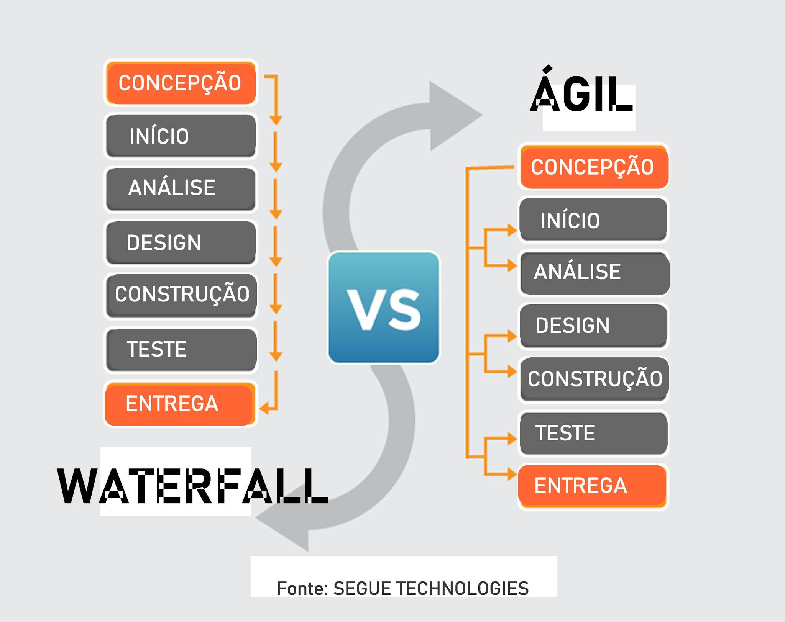
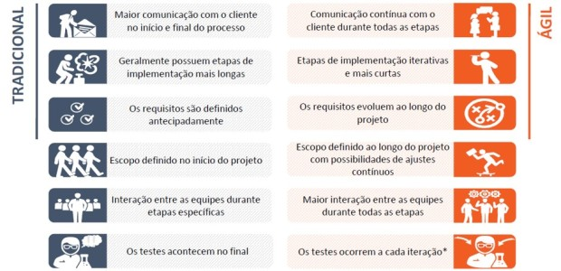

# Aula I - Introdução a Gestão de projetos e ao SCRUM

### Desafios do Desenvolvimento de Software

Objetivo de negócio =>| Processo de desenvolvimentno =>| Software
----------------------|--------------------------------|---------
 requesitos           | Concepção
 requesitos			  | Análise e Design
 requesitos			  | Desenvolvimento
 requesitos			  | Testes
 requesitos		      | Implantação

           				

### Gestão de Projeto - Tradicional x Ágil
 - Tradicional (Waterfall): Só permite que o projeto avance quando uma fase está inteiramente completa.
 - Ágil: Software construido por partes (incremental) e cada parte executa-se um ciclo (iterativo).

 

 

## SCRUM

 - É um dos frameworks de gerenciamento de projetos ágeis
 - Projetos usando equipes pequenas e multidiciplinares produzem os melhores resultados

### Três Pilares do SCRUM:
 1. Trânsparência
 2. Adaptação
 3. Inspeção

-  Conversar mais e escrever menos
- Demonstrar o Software constatemente aos usuários e obter feedbacks constantes.
- Requisitos mudam ao longo do tempo
-  Aprender progressivamento com o uso do software.

### Características do time SCRUM:
 - Equipes capazes de se auto organizarem
 - As tarefas são do time e todos são responsáveis
 - Forte comprometimento com os resultados

### MVP (Minimun Viable Product)

# Aula II - Papéis e Responsabilidades de cada um do time

- Product Owner (PO)
- Scrum Master (SM)
- Time de desenvolvimento (DEV) Geralmente um time é formado de 3 a 9 pessoas.

### Product Owner (PO):

- Representante da área de negócio
- PO não é um comitê
- Define as funcionalidades do software (Product Backlog)
- Prioriza as funcionalidades de acordo com o valor do negócio
- Garante que o time de desenvolvimento entenda os itens do Backlog no nível necessário

### Scrum Master (SM)
 - Garantir o uso correto do SCRUM
 - Scrum Master não é gerente de projeto
 - Age como facilitador
 - Auxilia o PO no planejamento e estimativa do backlog
 - Auxilia a equipe a remover impedimentos
 - Treina o time em autogerenciamento e interdisciplinaridade

 ### Time DEV

 - Possui habilidades suficientes para desenvolver, testar, criar e desenhar, ou seja, tudo o que for necessário para entregar o software funcionando.
 
# Aula III - Cerimônias do SCRUM

___Time Box:___
Tempo máximo para fazer uma cerimônia ou Sprint

___Sprint:___
Corrida, arrancada => É o principal evento do SCRUM

Duração de 1 Sprint: 30 dias corridos ou menos.

### Composição de uma Sprint:
- Planejamento da Sprint
- Reuniões diárias (Daily  Meeting)
- Revisão da Sprint (Review)
- Retrospectiva da Sprint

